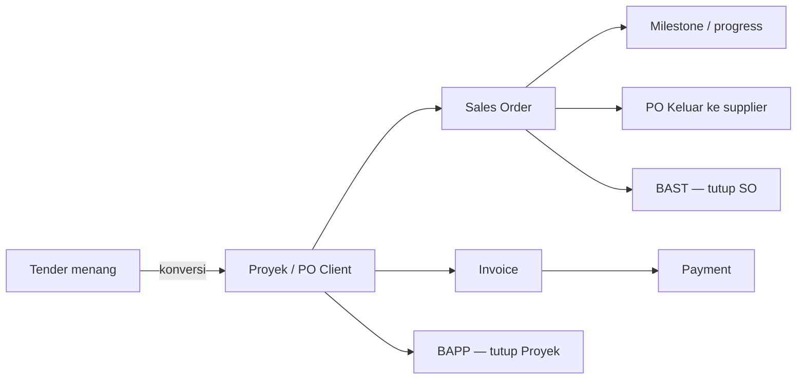

# HoldingOS — Manajemen Multi-Perusahaan

Aplikasi manajemen & monitoring **multi-perusahaan** untuk group holding
(general supplier, pengadaan barang/jasa, konstruksi). UI Bahasa Indonesia,
tema navy enterprise.

🔗 **Live:** https://dhanyindraswara.github.io/canproject/

Dibuat dengan **React + Vite + TypeScript**, di-host di **GitHub Pages**, dan
didukung backend **Firebase** (Authentication + Firestore + Cloud Storage).
Tanpa Firebase, aplikasi tetap jalan dalam **mode lokal** (data di
`localStorage`) sebagai fallback.

## Dokumentasi

| Dokumen | Untuk siapa | Isi |
| --- | --- | --- |
| 📘 [`docs/USER_GUIDE.md`](./docs/USER_GUIDE.md) | Pengguna | Cara login, tiap menu, dokumen, export PDF, user & role |
| 🏗️ [`docs/ARCHITECTURE.md`](./docs/ARCHITECTURE.md) | Developer | Arsitektur, diagram alur, model data, cara extend |
| 🔥 [`FIREBASE_SETUP.md`](./FIREBASE_SETUP.md) | Admin | Setup project Firebase dari nol |

## Konsep inti

- **Single login, multi-company.** Perusahaan bukan login terpisah — melainkan
  **filter global** lewat Company Switcher di header. "Semua Perusahaan" =
  mode holding.
- Navigasi **project-centric**: Tender → Proyek (PO Client) → Sales Order →
  BAST (tutup SO) → BAPP (tutup Proyek) → Invoice → Payment.
- Data & dokumen **tersimpan di cloud** (Firestore + Storage) saat Firebase
  aktif; role mengatur landing page & menu yang tampil.



## Menjalankan (developer)

```bash
npm install
npm run dev        # dev server (http://localhost:5173)
npm run build      # typecheck (tsc -b) + production build ke dist/
npm run preview    # preview hasil build
```

Base path produksi = `/canproject/` (lihat `vite.config.ts`), sesuai subpath
GitHub Pages.

## Struktur singkat

```
src/
  main.tsx            entry point
  App.tsx             providers + routing + resolusi role saat login
  store.tsx           state navigasi & auth (AppProvider)
  dataStore.tsx       semua data bisnis + sinkron Firestore/Storage (DataProvider)
  firebase.ts         inisialisasi Firebase (Auth/Firestore/Storage)
  firebaseConfig.ts   konfigurasi project (public client config)
  roles.ts            pemetaan role → landing & visibilitas menu
  theme.ts            token warna, perusahaan/status/role, format Rupiah
  data.ts             seed data + tipe
  components/         Sidebar, Header, Toast, Modal/DocumentManager/DocViewer, ui
  screens/            satu file per halaman
firestore.rules       security rules Firestore
storage.rules         security rules Cloud Storage
.github/workflows/    deploy.yml (CI/CD ke GitHub Pages)
```

Lihat [`docs/ARCHITECTURE.md`](./docs/ARCHITECTURE.md) untuk diagram lengkap.
