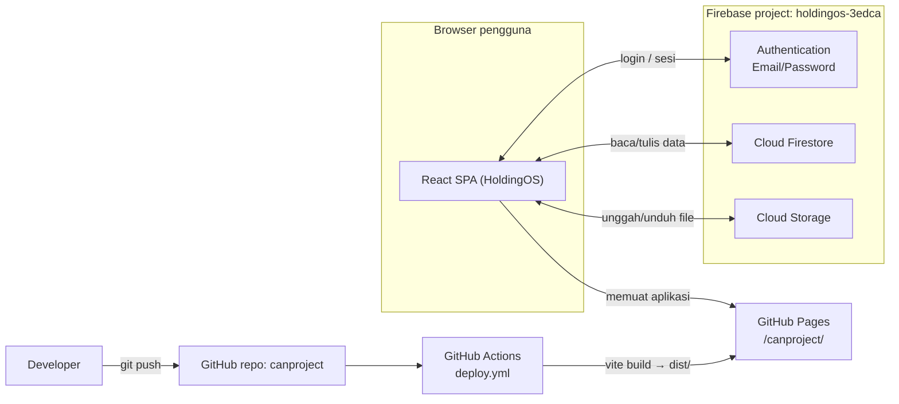
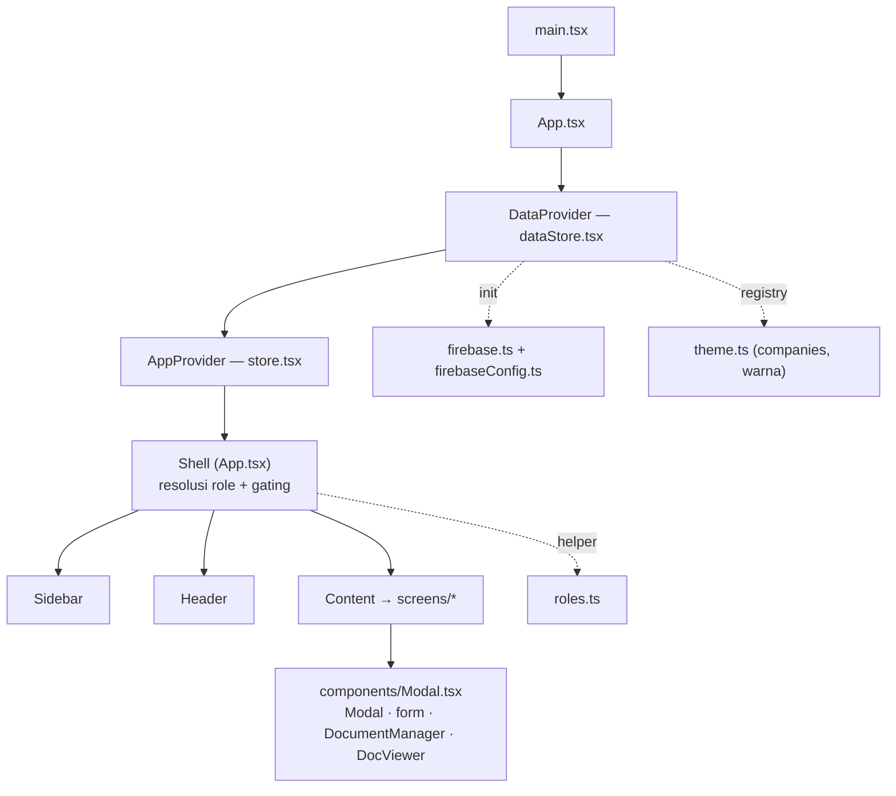
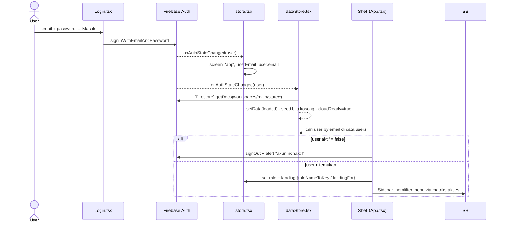
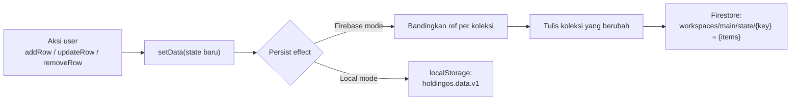
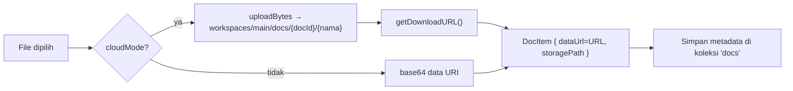
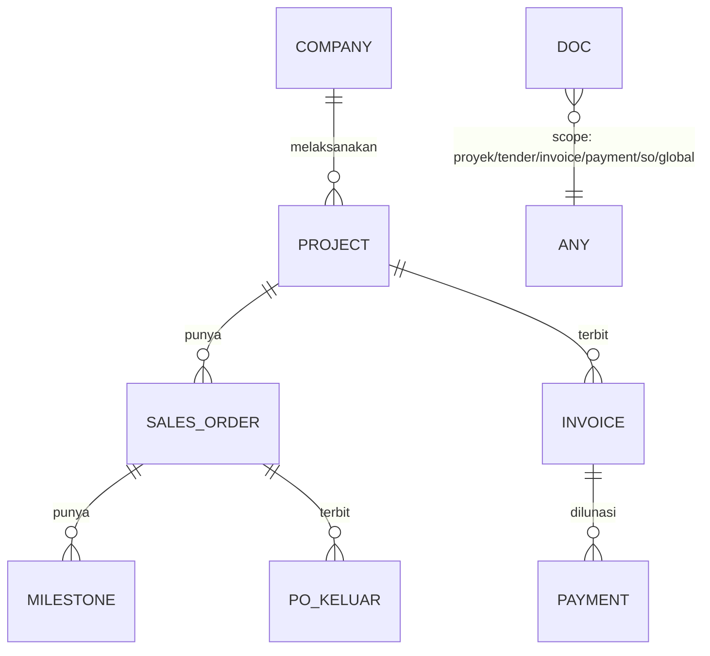
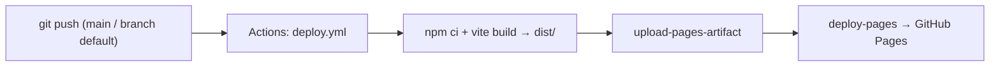

# Arsitektur & Panduan Developer — HoldingOS

Dokumen teknis: arsitektur sistem, alur, model data, dan cara mengembangkan.

---

## 1. Ringkasan teknologi

| Lapisan | Teknologi |
| --- | --- |
| Frontend | React 18 + TypeScript + Vite 5 (SPA murni, tanpa server sendiri) |
| Styling | Inline styles + token di `theme.ts` (tanpa framework CSS) |
| Auth | Firebase Authentication (Email/Password) |
| Database | Cloud Firestore |
| File storage | Cloud Storage for Firebase |
| Hosting | GitHub Pages (static) |
| CI/CD | GitHub Actions (`.github/workflows/deploy.yml`) |
| Fallback | `localStorage` (mode lokal saat Firebase tidak dikonfigurasi) |

Karena SPA statis, **tidak ada backend server** — browser berbicara langsung
ke Firebase, keamanan dijaga oleh **Security Rules**.

## 2. Arsitektur sistem (deployment)

## 3. Struktur aplikasi & providers

Dua React Context bersarang: **DataProvider** (data bisnis + sinkron cloud) di
luar, **AppProvider** (navigasi, sesi, role, toast) di dalam.

- **`store.tsx` (AppProvider)** — state UI/navigasi: `screen`, `menu`, `company`,
  tab aktif, `role`, `currentRoleName`, `userEmail`, `toast`; plus subscription
  `onAuthStateChanged` untuk membuka/menutup app.
- **`dataStore.tsx` (DataProvider)** — seluruh koleksi data + dokumen + notes;
  memuat/menyimpan ke Firestore (atau localStorage), upload ke Storage, dan
  helper CRUD generik (`addRow`, `updateRow`, `removeRow`, `setRows`, `rows`).

## 4. Alur autentikasi + resolusi role

Pemetaan role diatur di **`roles.ts`**: `menuAllowed()` menentukan visibilitas
menu dari **Matriks Hak Akses** (yang bisa diedit user), `landingFor()`
menentukan halaman awal, `roleNameToKey()` menautkan nama role ke enum internal.

## 5. Alur persistensi data (write-through)

Setiap mutasi membuat state baru; sebuah effect menulis **hanya koleksi yang
berubah** (perbandingan referensi) ke Firestore, atau seluruh state ke
localStorage pada mode lokal.

Saat login pertama pada project baru, seed contoh ditulis sekali ke Firestore.

## 6. Alur dokumen (Cloud Storage)

Field `dataUrl` bersifat seragam: berisi `https://` (Storage) di mode Firebase
atau `data:` URI di mode lokal — sehingga komponen viewer/``/`<iframe>`
tidak perlu tahu mode-nya. Hapus dokumen juga menghapus objek Storage bila ada.

## 7. Model data

Firestore menyimpan tiap koleksi sebagai satu dokumen di
`workspaces/main/state/{key}` berbentuk `{ items: [...] }`.

Koleksi (key di `dataStore.tsx → ALL_KEYS`): `projects`, `tenders`,
`salesOrders`, `invoices`, `payments`, `poKeluar`, `stok`, `aset`, `users`,
`clients`, `suppliers`, `banks`, `companies`, `accessMatrix`, `docs`, `notes`.
Setiap baris punya `id` unik. Dokumen (`docs`) memakai `scope` (mis.
`proyek:{id}`, `invoice:{id}`, `payment:{id}`, `global`) untuk relasi.

## 8. Navigasi / routing

Tanpa router library — routing berbasis state `menu` + flag drill-down
(`detailProyek`, `detailSO`) di `store.tsx`, dirender oleh `Content()` di
`App.tsx`. Perpindahan lewat `go(menu)` / `openProyek(id)` / `openSO(id)`.

## 9. Keamanan (Security Rules)

- `firestore.rules` & `storage.rules` (di root repo): **semua akses butuh user
  login**; upload dibatasi 15 MB. Cocok untuk tool internal; bisa diperketat
  per-role/perusahaan.
- **Client config bukan rahasia** — `firebaseConfig.ts` aman di-commit;
  keamanan ditegakkan oleh Rules, bukan menyembunyikan API key.
- Domain GitHub Pages harus ditambahkan ke **Authorized domains** Firebase Auth.

## 10. CI/CD (deploy)

> Catatan repo ini: GitHub Pages men-deploy dari **branch default**
> (`claude/duplicate-repository-7jvug2`). `main` di-jaga sinkron dengan branch
> tersebut. `vite.config.ts` memakai `base: '/canproject/'`.

## 11. Cara mengembangkan (extend)

**Menambah koleksi data baru**
1. Tambah tipe & seed di `data.ts`, dan tipe `...Row` + key ke `DataState` /
   `ALL_KEYS` / `CollKey` di `dataStore.tsx`.
2. Pakai `rows('key')`, `addRow`, `updateRow`, `removeRow` di screen.

**Menambah halaman/menu**
1. Tambah `MenuKey` di `theme.ts`, entri di `Sidebar.tsx` (`MENUS`), dan `case`
   di `Content()` (`App.tsx`).
2. (Opsional) petakan visibilitas di `roles.ts → MENU_ACCESS`.

**Upload/lihat dokumen** — pakai `<DocumentManager scope="..." />` dari
`components/Modal.tsx`; viewer besar (`DocViewer`) sudah otomatis.

**Export PDF** — pakai `printDocument()` dari `src/print.ts`.

**Menonaktifkan Firebase (mode lokal)** — kosongkan/placeholder-kan `apiKey` di
`firebaseConfig.ts`; `firebaseEnabled` jadi `false` dan app memakai
localStorage.

## 12. Keterbatasan yang diketahui

- Satu **workspace bersama** (`workspaces/main`) — semua user berbagi data.
- Tiap koleksi = satu dokumen Firestore (batas 1 MB/dokumen); cukup untuk skala
  kecil–menengah. Untuk data besar, pecah jadi sub-dokumen per item.
- Role membatasi **menu & landing**, belum menegakkan izin di level Security
  Rules (bisa ditambahkan bila perlu RBAC ketat).
- Menghapus user di app tidak menghapus akun Firebase Auth-nya (hapus manual di
  Console).
- Bundle memuat Firebase SDK (~260 KB gzip); bisa di-code-split bila perlu.
